# DBeaver 오픈소스 학습 가이드

## 📚 목차
1. [프로젝트 개요](#프로젝트-개요)
2. [개발 환경 설정](#개발-환경-설정)
3. [프로젝트 구조](#프로젝트-구조)
4. [핵심 아키텍처](#핵심-아키텍처)
5. [주요 컴포넌트](#주요-컴포넌트)
6. [학습 로드맵](#학습-로드맵)
7. [기여 가이드](#기여-가이드)
8. [참고 자료](#참고-자료)

---

## 프로젝트 개요

### 기본 정보
- **프로젝트명**: DBeaver Community Edition
- **라이선스**: Apache License 2.0
- **언어**: Java (약 5,900개 파일)
- **플랫폼**: Windows, Linux, macOS (x86_64, ARM64)
- **커밋 수**: 29,000+ 커밋
- **플러그인 수**: 140+ 플러그인

### 주요 기술 스택
| 기술 | 용도 |
|------|------|
| **Eclipse RCP** | UI 프레임워크 |
| **OSGi (Equinox)** | 플러그인 시스템 |
| **SWT** | 네이티브 UI 위젯 |
| **JDBC** | 데이터베이스 연결 |
| **Maven + Tycho** | 빌드 시스템 |
| **JSQLParser** | SQL 파싱 |
| **ANTLR4** | SQL 문법 분석 |
| **Java 21** | 런타임 |

### 프로젝트 통계
- 총 Java 파일: 5,901개
- 플러그인 디렉토리: 140개
- 지원 DB: 100+ (커뮤니티), 150+ (PRO)
- 주요 기여자: Serge Rider (9,884 커밋)

---

## 개발 환경 설정

### 1. 필수 요구사항
```bash
# Java Development Kit 21
java -version  # OpenJDK 21 이상

# Maven 3.8+
mvn -version

# Git
git --version
```

### 2. 저장소 클론 및 설정
```bash
# 포크된 저장소 클론
git clone https://github.com/YUJAEYUN/dbeaver.git
cd dbeaver

# upstream 원본 저장소 추가
git remote add upstream https://github.com/dbeaver/dbeaver.git

# 원본 최신 변경사항 가져오기
git fetch upstream
git merge upstream/devel
```

### 3. 빌드 방법
```bash
# 기본 빌드 (현재 플랫폼만)
mvn clean install

# 모든 플랫폼 빌드
mvn clean install -P all-platforms

# 특정 모듈만 빌드
cd plugins/org.jkiss.dbeaver.model
mvn clean install
```

### 4. IDE 설정

#### Eclipse 사용
```bash
# Eclipse 워크스페이스 생성
./generate_workspace.sh  # Linux/Mac
generate_workspace.cmd   # Windows

# Eclipse에서:
# File → Import → Existing Maven Projects
# Root Directory: dbeaver 폴더 선택
```

#### IntelliJ IDEA 사용
```
File → Open → dbeaver/pom.xml 선택
Maven 프로젝트로 import
```

### 5. 실행 방법
빌드 후 생성된 제품 실행:
```bash
# 위치
product/community/target/products/

# 각 플랫폼별 실행 파일
- dbeaver-<version>-macosx.cocoa.x86_64/
- dbeaver-<version>-linux.gtk.x86_64/
- dbeaver-<version>-win32.win32.x86_64/
```

---

## 프로젝트 구조

### 최상위 디렉토리 구조
```
dbeaver/
├── plugins/              # 140+ 플러그인 (핵심 코드)
├── features/             # Eclipse Feature 정의
├── product/              # 제품 빌드 설정
│   ├── community/        # 커뮤니티 에디션
│   ├── repositories/     # P2 저장소(P2는 프로비저닝의 약자)
│   └── appstore/         # 앱스토어 버전
├── test/                 # 테스트 코드
├── docs/                 # 문서 및 라이선스
├── tools/                # 빌드 도구
├── .github/              # GitHub 설정
├── pom.xml               # Maven 루트 설정
└── README.md
```

### 플러그인 분류

#### 핵심 플러그인 (Core)
```
plugins/
├── org.jkiss.dbeaver.model/           # 데이터 모델 (DBP*, DBC*, DBS*)
├── org.jkiss.dbeaver.model.sql/       # SQL 파서, 포매터
├── org.jkiss.dbeaver.model.jdbc/      # JDBC 연결
├── org.jkiss.dbeaver.registry/        # 플러그인 레지스트리
└── org.jkiss.dbeaver.core/            # 핵심 애플리케이션
```

#### UI 플러그인
```
plugins/
├── org.jkiss.dbeaver.ui/                    # 기본 UI
├── org.jkiss.dbeaver.ui.editors.sql/        # SQL 에디터 (122MB)
├── org.jkiss.dbeaver.ui.editors.data/       # 데이터 에디터
├── org.jkiss.dbeaver.ui.navigator/          # DB 네비게이터
└── org.jkiss.dbeaver.ui.editors.connection/ # 연결 설정
```

#### 데이터베이스 확장 플러그인 (69개)
```
plugins/
├── org.jkiss.dbeaver.ext.postgresql/      # PostgreSQL
├── org.jkiss.dbeaver.ext.mysql/           # MySQL
├── org.jkiss.dbeaver.ext.oracle/          # Oracle
├── org.jkiss.dbeaver.ext.mssql/           # SQL Server
├── org.jkiss.dbeaver.ext.db2/             # DB2
├── org.jkiss.dbeaver.ext.snowflake/       # Snowflake
├── org.jkiss.dbeaver.ext.bigquery/        # Google BigQuery
└── ... (60개 이상)
```

#### 기능 플러그인
```
plugins/
├── org.jkiss.dbeaver.data.transfer/       # 데이터 전송/내보내기
├── org.jkiss.dbeaver.data.gis/            # 공간 데이터 (GIS)
├── org.jkiss.dbeaver.data.office/         # Excel/Office 포맷
├── org.jkiss.dbeaver.debug.core/          # 디버깅
├── org.jkiss.dbeaver.model.ai/            # AI 통합
└── org.jkiss.dbeaver.tasks.ui/            # 작업 관리
```

---

## 핵심 아키텍처

### 1. 계층형 구조

```
┌─────────────────────────────────────┐
│      UI Layer (RCP/SWT)             │
│  ┌───────────┬──────────┬─────────┐ │
│  │SQL Editor │Data View │Navigator│ │
│  └───────────┴──────────┴─────────┘ │
├─────────────────────────────────────┤
│      Model Layer (Business Logic)   │
│  ┌─────────────┬─────────────────┐  │
│  │  Model API  │  SQL Parser     │  │
│  │  (DBP/DBC)  │  (JSQLParser)   │  │
│  └─────────────┴─────────────────┘  │
├─────────────────────────────────────┤
│      Data Access Layer (JDBC:Java Database Connectivity. 쉽게 말해서 데이터베이스에 접근할 수 있는 자발로 작성된 api)       │
│  ┌────────┬────────┬──────────────┐ │
│  │MySQL   │PG      │Oracle  ...   │ │
│  └────────┴────────┴──────────────┘ │
└─────────────────────────────────────┘
```

### 2. OSGi 플러그인 시스템

#### 플러그인 구조
```
plugin-directory/
├── META-INF/
│   └── MANIFEST.MF              # OSGi 번들 정의
│       - Bundle-SymbolicName
│       - Bundle-Version
│       - Require-Bundle         # 의존성
│       - Export-Package         # 공개 패키지
│
├── plugin.xml                   # Eclipse 확장 정의
│   - Extension Points           # 확장 포인트
│   - Extensions                 # 확장 구현
│
├── OSGI-INF/                    # Declarative Services
├── src/                         # Java 소스
├── icons/                       # 리소스
└── pom.xml                      # Maven 빌드
```

#### 핵심 확장 포인트
```xml
<!-- 데이터소스 제공자 -->
<extension point="org.jkiss.dbeaver.dataSourceProvider">
    <provider id="postgresql"
              class="...PostgreDataSourceProvider"/>
</extension>

<!-- SQL 에디터 확장 -->
<extension point="org.jkiss.dbeaver.sql.editorContributor">
    <contributor class="...SQLEditorContributor"/>
</extension>

<!-- 데이터 타입 핸들러 -->
<extension point="org.jkiss.dbeaver.dataTypeProvider">
    <provider class="...TypeProvider"/>
</extension>
```

### 3. 주요 인터페이스

#### DBPDataSource (데이터소스)
```java
public interface DBPDataSource extends DBSInstance {
    DBPDataSourceContainer getContainer();
    DBPDataSourceInfo getInfo();
    SQLDialect getSQLDialect();
    void initialize(DBRProgressMonitor monitor);
    DBCExecutionContext openIsolatedContext(String purpose);
}
```

#### DBCExecutionContext (실행 컨텍스트)
```java
public interface DBCExecutionContext {
    DBPDataSource getDataSource();
    DBCSession openSession(DBRProgressMonitor monitor,
                           DBCExecutionPurpose purpose,
                           String taskTitle);
    boolean isConnected();
}
```

#### DBCSession (세션)
```java
public interface DBCSession extends DBCExecutionContext {
    DBCStatement prepareStatement(DBCStatementType type,
                                  String sqlQuery);
    DBCTransactionManager getTransactionManager();
}
```

#### DBSObject (데이터베이스 객체)
```java
public interface DBSObject {
    String getName();
    String getDescription();
    DBSObject getParentObject();
    DBPDataSource getDataSource();
    boolean isPersisted();
}

// 계층 구조
DBSObject
├── DBSInstance (서버 인스턴스)
│   └── DBSObjectContainer
│       ├── DBSCatalog (카탈로그/데이터베이스)
│       └── DBSSchema (스키마)
│           ├── DBSEntity (테이블/뷰)
│           ├── DBSProcedure (프로시저)
│           └── DBSSequence (시퀀스)
```

---

## 주요 컴포넌트

### 1. 데이터베이스 연결 흐름

```
사용자 액션: "New Connection"
↓
DataSourceCreateHandler
↓
DataSourceProviderRegistry.getProvider(driverId)
↓
DBPDataSourceProvider.openDataSource(...)
↓
PostgreDataSource.initialize(monitor)
  ├── JDBC 연결 생성
  ├── 메타데이터 로딩
  ├── DBSObjectCache 초기화
  └── 스키마 목록 캐싱
↓
DBCExecutionContext 생성
↓
네비게이터 트리에 표시
```

### 2. SQL 에디터 구조

```
SQLEditor (메인 에디터)
├── SQLEditorControl
│   ├── SQLSourceViewer
│   │   ├── SQLSyntaxHighlighting      # 구문 강조
│   │   ├── SQLContentAssist           # 자동완성
│   │   ├── SQLHyperlinkDetector       # 하이퍼링크
│   │   └── SQLFoldingStrategy         # 코드 폴딩
│   │
│   ├── ResultSetViewer (결과 뷰)
│   │   ├── Spreadsheet 모드
│   │   ├── Grid 모드
│   │   └── Plain Text 모드
│   │
│   └── SQLEditorOutputViewer          # 로그/메시지
│
└── 상태 바
    ├── 연결 선택기
    ├── 트랜잭션 제어
    └── 실행 시간 통계
```

### 3. SQL 실행 프로세스

```java
// 1. SQL 실행 커맨드
SQLEditorHandlerExecute.execute(...)

// 2. SQL 분석 및 분할
SQLScriptParser.parseScript(sqlText)
  → List<SQLScriptElement>

// 3. 각 문장 실행
for (SQLScriptElement query : queries) {
    // 4. 세션 생성
    DBCSession session =
        context.openSession(monitor, purpose, taskTitle);

    // 5. Statement 준비
    DBCStatement stmt =
        session.prepareStatement(query.getText());

    // 6. 실행
    boolean hasResultSet = stmt.executeStatement();

    // 7. 결과 처리
    if (hasResultSet) {
        DBCResultSet resultSet = stmt.openResultSet();
        // ResultSetViewer에 표시
    }
}
```

### 4. 메타데이터 캐싱

```java
// 캐시 계층
public class JDBCObjectCache<OWNER, OBJECT> {
    private List<OBJECT> objectList;
    private Map<String, OBJECT> objectMap;

    public List<OBJECT> getAllObjects(
        DBRProgressMonitor monitor, OWNER owner) {
        if (objectList == null) {
            loadObjects(monitor, owner);  // 지연 로딩
        }
        return objectList;
    }
}

// 사용 예
class PostgreSchema extends JDBCSchema {
    // 테이블 캐시
    private TableCache tableCache =
        new TableCache(PostgreTableBase.class);

    @Override
    public Collection<PostgreTableBase> getTables() {
        return tableCache.getAllObjects(monitor, this);
    }
}
```

### 5. 데이터베이스별 확장 구현

#### PostgreSQL 예시
```java
// 1. DataSourceProvider 구현
public class PostgreDataSourceProvider
    implements DBPDataSourceProvider {

    @Override
    public DBPDataSource openDataSource(
        DBRProgressMonitor monitor,
        DBPDataSourceContainer container) {
        return new PostgreDataSource(monitor, container);
    }
}

// 2. DataSource 구현
public class PostgreDataSource
    extends JDBCDataSource {

    @Override
    public void initialize(DBRProgressMonitor monitor) {
        // PostgreSQL 특화 초기화
        super.initialize(monitor);
        // 버전 확인, 확장 로딩 등
    }

    @Override
    public SQLDialect getSQLDialect() {
        return PostgreSQLDialect.INSTANCE;
    }
}

// 3. 구조 객체 구현
public class PostgreTable
    extends JDBCTable<PostgreDataSource, PostgreSchema> {

    @Override
    public Collection<PostgreTableColumn> getAttributes() {
        return getContainer().tableCache.getChildren(monitor, this);
    }
}
```

---

## 학습 로드맵

### Level 1: 초급 (1-2주)

#### 목표: 프로젝트 전체 구조 파악

**학습 내용**
1. Eclipse RCP 기본 개념
   - RCP란 무엇인가?
   - SWT vs Swing
   - Workbench, Perspective, View

2. OSGi 기본
   - 번들(Bundle)의 개념
   - MANIFEST.MF 읽는 법
   - 의존성 관리

3. 코드 탐색
   - README.md, CONTRIBUTING.md 읽기
   - Wiki 문서 훑어보기
   - 프로젝트 빌드 및 실행

**실습 과제**
```bash
# 1. 프로젝트 클론 및 빌드
git clone https://github.com/YUJAEYUN/dbeaver.git
cd dbeaver
mvn clean install

# 2. 플러그인 구조 살펴보기
ls plugins/
cat plugins/org.jkiss.dbeaver.model/META-INF/MANIFEST.MF

# 3. 간단한 코드 읽기
# org.jkiss.dbeaver.model/src/org/jkiss/dbeaver/model/DBPDataSource.java
```

**추천 파일**
- `plugins/org.jkiss.dbeaver.model/src/org/jkiss/dbeaver/model/`
  - `DBPDataSource.java`
  - `DBPDriver.java`
  - `struct/DBSObject.java`

### Level 2: 중급 (2-4주)

#### 목표: 핵심 컴포넌트 이해

**학습 내용**
1. 데이터소스 아키텍처
   - DBPDataSourceProvider 인터페이스
   - DBPDataSource 구현
   - 연결 생명주기

2. 구조 모델 (Structure Model)
   - DBSObject 계층구조
   - DBSObjectCache 메커니즘
   - 지연 로딩 패턴

3. SQL 에디터
   - SQL 파싱 (JSQLParser)
   - 구문 강조
   - 자동완성

**실습 과제**
```java
// 1. 기존 DB 드라이버 코드 읽기
// org.jkiss.dbeaver.ext.postgresql/
//   - PostgreDataSourceProvider.java
//   - PostgreDataSource.java
//   - model/PostgreTable.java

// 2. 간단한 플러그인 만들기
// "Hello DBeaver" 메뉴 추가
<extension point="org.eclipse.ui.commands">
    <command id="com.example.hello"
             name="Hello DBeaver"/>
</extension>
```

**디버깅 방법**
```bash
# Eclipse에서 실행 구성
Run → Debug Configurations
→ Eclipse Application 선택
→ New Configuration 생성
→ 디버그 모드로 실행
```

**추천 파일**
- `plugins/org.jkiss.dbeaver.ext.postgresql/`
  - `PostgreDataSourceProvider.java`
  - `model/PostgreTable.java`
  - `model/PostgreTableColumn.java`
- `plugins/org.jkiss.dbeaver.model.sql/`
  - `SQLSyntaxManager.java`
  - `SQLScriptParser.java`

### Level 3: 고급 (4-8주)

#### 목표: 기여 가능한 수준

**학습 내용**
1. 새로운 데이터베이스 드라이버 추가
   - 드라이버 플러그인 구조
   - JDBC 메타데이터 추출
   - SQL 방언(Dialect) 구현

2. UI 확장
   - View/Editor 추가
   - Preference Page 생성
   - 커맨드/핸들러 구현

3. 고급 기능
   - 데이터 전송/내보내기
   - ER 다이어그램
   - SQL 디버깅

**실습 과제**

**과제 1: 간단한 DB 드라이버 추가**
```
목표: SQLite나 H2 같은 간단한 DB를 참고하여
      가상의 데이터베이스 드라이버 구현

단계:
1. 플러그인 프로젝트 생성
   - org.jkiss.dbeaver.ext.mydb
   - org.jkiss.dbeaver.ext.mydb.ui

2. DataSourceProvider 구현
3. 테이블/컬럼 모델 구현
4. plugin.xml 확장 등록
5. 테스트
```

**과제 2: SQL 에디터 기능 추가**
```
목표: SQL 에디터에 커스텀 기능 추가
      (예: SQL 템플릿, 스니펫 등)

단계:
1. SQLEditorContributor 구현
2. 메뉴/툴바 버튼 추가
3. 액션 핸들러 구현
```

**추천 학습 자료**
- Eclipse RCP 공식 문서
- OSGi 스펙 문서
- DBeaver Wiki: Build from sources
- DBeaver Wiki: Contribute your code

### Level 4: 전문가 (지속적)

#### 목표: 메인테이너 수준

**학습 내용**
1. 코드 리뷰 참여
2. 이슈 트리아지
3. 새로운 기능 설계
4. 성능 최적화
5. 테스트 작성

---

## 기여 가이드

### 1. 기여 프로세스

```mermaid
graph LR
    A[이슈 찾기] --> B[포크 & 브랜치]
    B --> C[코드 작성]
    C --> D[테스트]
    D --> E[커밋]
    E --> F[Push]
    F --> G[PR 생성]
    G --> H[코드 리뷰]
    H --> I[머지]
```



### 2. 단계별 가이드

#### Step 1: 기여할 이슈 찾기
```
GitHub 이슈 탐색:
- Label: "Good first issue"  # 초보자 친화적
- Label: "Help wanted"        # 도움 필요
- Label: "wait for votes"     # 투표 대기
```

#### Step 2: 작업 시작
```bash
# upstream에서 최신 코드 가져오기
git fetch upstream
git checkout devel
git merge upstream/devel

# 새 브랜치 생성
git checkout -b feature/my-feature
# 또는
git checkout -b fix/issue-1234
```

#### Step 3: 코드 작성
```
DBeaver 코딩 스타일:
- Java 코드 스타일: docs/codestyle/eclipse-formatter-profile.xml
- 들여쓰기: 4 spaces
- 라인 길이: 120자
- 주석: Javadoc 권장
```

#### Step 4: 테스트
```bash
# 유닛 테스트 실행
cd test/org.jkiss.dbeaver.test.platform
mvn test

# 수동 테스트
# 1. 빌드 후 실행
# 2. 변경 기능 확인
# 3. 기존 기능 정상 동작 확인
```

#### Step 5: 커밋
```bash
# 의미있는 커밋 메시지
git add .
git commit -m "#1234 Add support for new database feature

- Implement DataSourceProvider
- Add table metadata extraction
- Update documentation"
```

#### Step 6: Pull Request
```bash
# 포크한 저장소에 Push
git push origin feature/my-feature

# GitHub에서 PR 생성
# Base: dbeaver/dbeaver:devel
# Compare: YUJAEYUN/dbeaver:feature/my-feature
```

#### PR 템플릿
```markdown
## 변경 내용
간단한 변경 사항 설명

## 관련 이슈
Fixes #1234

## 체크리스트
- [ ] 코드가 정상적으로 빌드됨
- [ ] 테스트를 추가/업데이트함
- [ ] 문서를 업데이트함
- [ ] 코드 스타일을 준수함

## 스크린샷 (UI 변경시)
```

### 3. 기여 팁

**DO (권장)**
- 작은 PR로 시작하기
- 기존 코드 스타일 따르기
- 명확한 커밋 메시지 작성
- 테스트 추가
- 문서 업데이트

**DON'T (비권장)**
- 형식 변경만 하는 PR (타이포, 포매팅만)
- 너무 큰 PR
- 여러 기능을 한 PR에
- 테스트 없이 제출

### 4. 코드 리뷰 대응

```
리뷰어 피드백 → 코드 수정 → 추가 커밋 → Push
                                    ↓
                              자동으로 PR 업데이트
```

---

## 참고 자료

### 공식 문서
- [DBeaver 공식 사이트](https://dbeaver.io)
- [GitHub Wiki](https://github.com/dbeaver/dbeaver/wiki)
- [빌드 가이드](https://github.com/dbeaver/dbeaver/wiki/Build-from-sources)
- [기여 가이드](https://github.com/dbeaver/dbeaver/wiki/Contribute-your-code)

### 기술 문서
- [Eclipse RCP 가이드](https://www.eclipse.org/resources/)
- [OSGi 스펙](https://docs.osgi.org/)
- [Tycho 문서](https://www.eclipse.org/tycho/)
- [JDBC API](https://docs.oracle.com/javase/tutorial/jdbc/)

### 커뮤니티
- [GitHub Discussions](https://github.com/dbeaver/dbeaver/discussions)
- [GitHub Issues](https://github.com/dbeaver/dbeaver/issues)
- [Twitter @dbeaver_news](https://twitter.com/dbeaver_news)
- [YouTube DBeaver](https://www.youtube.com/@DBeaver_video)

### 관련 프로젝트
- [CloudBeaver (웹 버전)](https://github.com/dbeaver/cloudbeaver)
- [DBeaver Dependencies](https://github.com/dbeaver/dbeaver-deps-ce)

---

## 주요 패키지 참조 가이드

### 패키지별 책임

| 패키지 | 책임 |
|--------|------|
| `org.jkiss.dbeaver.model` | 핵심 데이터 모델 인터페이스 |
| `org.jkiss.dbeaver.model.impl` | 기본 구현체 |
| `org.jkiss.dbeaver.model.exec` | 실행 컨텍스트, 세션 |
| `org.jkiss.dbeaver.model.struct` | DB 구조 (테이블, 컬럼) |
| `org.jkiss.dbeaver.model.data` | 데이터 처리, 포매팅 |
| `org.jkiss.dbeaver.model.sql` | SQL 파싱, 분석 |
| `org.jkiss.dbeaver.model.runtime` | 작업, 진행 모니터 |
| `org.jkiss.dbeaver.registry` | 플러그인 레지스트리 |
| `org.jkiss.dbeaver.ui` | 기본 UI 컴포넌트 |
| `org.jkiss.dbeaver.ui.editors` | 에디터 프레임워크 |

---

## 디버깅 팁

### 로그 확인
```
위치:
- workspace/.metadata/.log  (Eclipse 실행시)
- <dbeaver>/dbeaver.log     (standalone 실행시)

로그 레벨 설정:
Window → Preferences → DBeaver → Logging
```

### 브레이크포인트 추천 위치
```java
// 연결 생성
org.jkiss.dbeaver.model.impl.jdbc.JDBCDataSource.initialize()

// SQL 실행
org.jkiss.dbeaver.ui.editors.sql.handlers.SQLEditorHandlerExecute.execute()

// 메타데이터 로딩
org.jkiss.dbeaver.model.impl.jdbc.cache.JDBCObjectCache.loadObjects()
```

### 유용한 VM 옵션
```
-Ddbeaver.logLevel=DEBUG
-Xmx4g                    # 힙 메모리
-XX:+UseG1GC              # GC 알고리즘
```

---

## FAQ

### Q: 빌드가 실패합니다.
```
A:
1. Java 21 사용 확인: java -version
2. Maven 3.8+ 확인: mvn -version
3. 클린 빌드: mvn clean install -U
4. 특정 모듈 스킵: mvn install -pl '!problematic-module'
```

### Q: 어떤 이슈부터 시작하면 좋을까요?
```
A:
1. Label: "Good first issue" 검색
2. 문서 개선 (README, Wiki)
3. 간단한 버그 수정
4. 기존 DB 드라이버 개선
```

### Q: 테스트는 어떻게 작성하나요?
```
A:
test/ 디렉토리 참고
- org.jkiss.dbeaver.model.sql.test
- org.jkiss.dbeaver.ext.postgresql.test

JUnit 4/5 사용
```

### Q: 새로운 데이터베이스를 추가하고 싶습니다.
```
A:
1. 기존 유사한 DB 플러그인 참조 (예: SQLite, H2)
2. DataSourceProvider 구현
3. 메타데이터 추출 로직 작성
4. plugin.xml에 확장 등록
5. 테스트
```

---

## 다음 단계

### 즉시 시작할 수 있는 작업

1. **코드 읽기**
   ```bash
   # 간단한 DB 드라이버부터
   cat plugins/org.jkiss.dbeaver.ext.sqlite/src/org/jkiss/dbeaver/ext/sqlite/*.java
   ```

2. **문서 개선**
   - README.md 오타 수정
   - Wiki 페이지 업데이트
   - 주석 추가

3. **이슈 탐색**
   ```
   https://github.com/dbeaver/dbeaver/issues?q=is%3Aissue+is%3Aopen+label%3A%22Good+first+issue%22
   ```

4. **테스트 작성**
   - 기존 기능에 대한 유닛 테스트 추가

---

## 마치며

DBeaver는 대규모 오픈소스 프로젝트로, 학습 곡선이 있지만 다음을 얻을 수 있습니다:

- Eclipse RCP 아키텍처 이해
- OSGi 플러그인 시스템 경험
- 대규모 Java 프로젝트 구조
- 오픈소스 기여 경험
- 데이터베이스 내부 동작 이해

**천천히, 단계적으로 학습하세요!**

Happy Coding!
